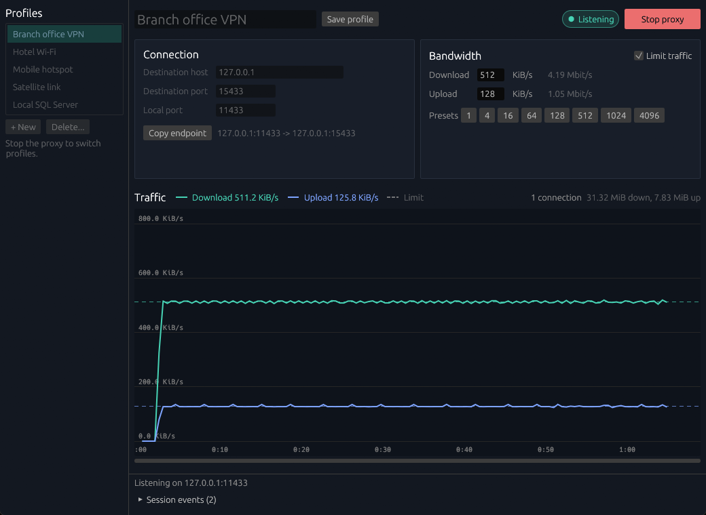

# Bandwidth Proxy

A small desktop tool that forwards a TCP port through localhost and caps download and upload speed. Use it to see how an app behaves on a slow link. It needs no admin rights, and the app under test only needs a different server address.



## Build

You need Rust. On Windows you also need the Visual Studio C++ build tools.

```powershell
cargo run --release
cargo test
```

## Use

1. Enter the destination host and port. The default is a local SQL Server at `127.0.0.1:1433`.
2. Pick a local port and click **Start proxy**. The proxy only listens on `127.0.0.1`.
3. Point the app under test at `127.0.0.1` and the local port. **Copy endpoint** copies the address, or the SQL Server form `tcp:127.0.0.1,<port>`.
4. Check **Limit traffic** and set the rates in KiB/s. A rate applies when you press Enter or leave the field, including on open connections.

All connections share one cap per direction. Unchecking **Limit traffic** removes the cap without disconnecting anyone. Stopping the proxy does disconnect clients, so don't stop it in the middle of a save or transaction.

Profiles are stored in `%APPDATA%\bandwidth-proxy\profiles.json`. On Linux and macOS the folder is `$XDG_CONFIG_HOME/bandwidth-proxy` or `~/.config/bandwidth-proxy`. The file holds hosts and ports, never credentials.
